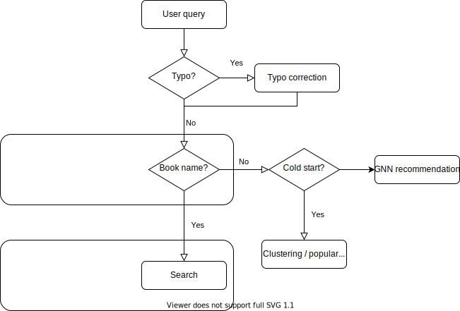

# Book recommendation

Flowchart

# Search engine

# Recommendation engine

# Spine_segmentation

Retrieve book information from picture by performing mutiple object detection.

Object detection was preferred to instance segmentation because data vertices annotations are not the best (often rectangle, so it does not make sense to perform both object detection and instance semantic segmentation).

Object detection framework is modified retinanet to acccept rotated bounding boxes

# Training data

### Books / users / ratings

Can be downloaded 

### Book spine
Roughly annotated book spine data (contains ~ 650 datapoint).

Can be downloaded 
